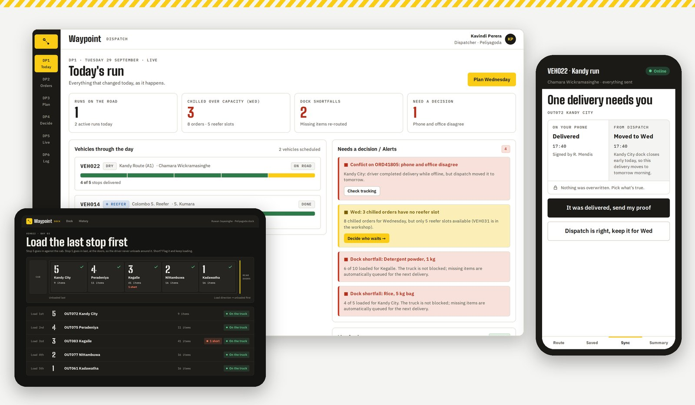
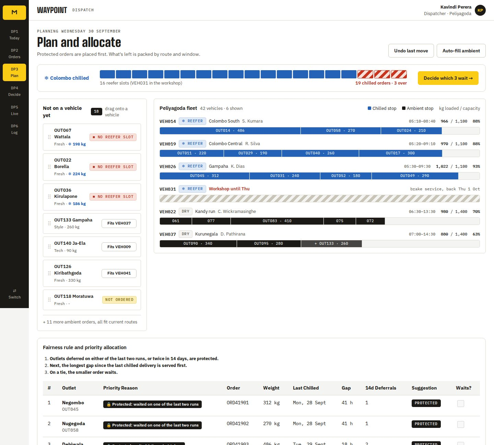
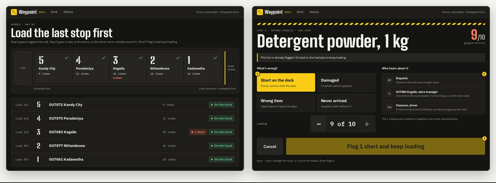
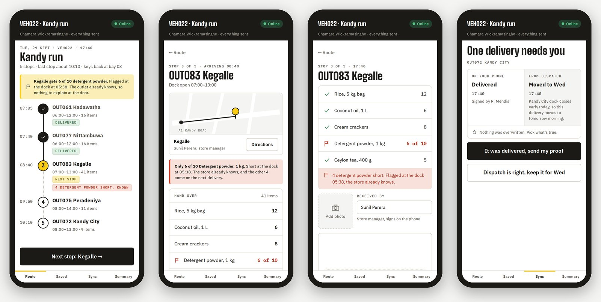
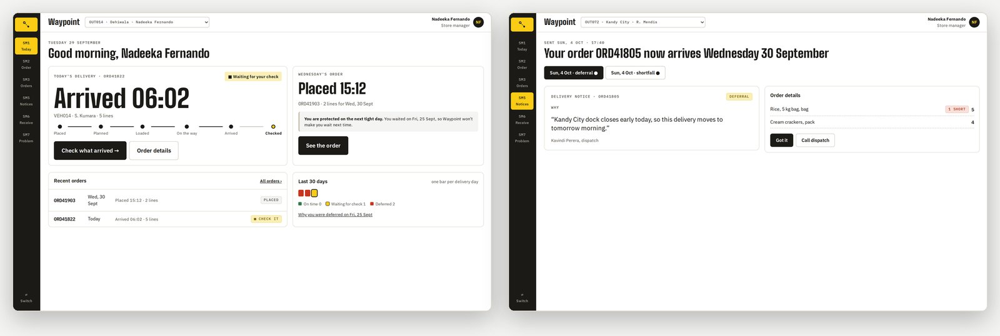
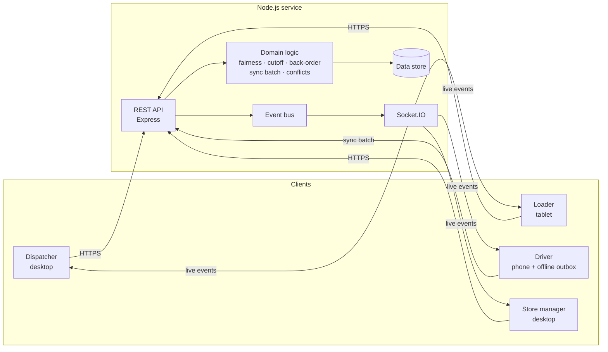

# Waypoint

[](https://github.com/theenuka/waypoint/actions/workflows/ci.yml) [](https://github.com/theenuka/waypoint/actions/workflows/deploy.yml)

**Explain the decision. Execute the run. Never lose the truth in between.**

Waypoint is a delivery operations platform for a retail chain that supplies its outlets from regional depots. It connects the four people who touch every delivery (the dispatcher, the dock loader, the driver and the store manager) to one live source of truth.

Team **smoothOperator** · Rootcode Tech-Triathlon 2026

**Live demo:** [waypoint.theenuka.in](https://waypoint.theenuka.in) · open a role in two windows (for example `/dispatcher` and `/driver`) to watch updates arrive live.



## The problem

Three things go wrong every day in outlet replenishment:

1. **Chilled capacity is short.** There are more chilled orders than refrigerated truck slots, so some stores wait. Today that decision is made ad hoc and the store finds out when the truck doesn't come.
2. **The dock is short.** Stock runs out while a truck is being loaded. Either the truck leaves late, or it leaves short and the store is surprised at the door.
3. **Drivers lose signal.** On routes like the A1 to Kandy, proof of delivery is lost or silently overwritten by changes made in the office.

## What Waypoint does

| Role | Device | In Waypoint |
|---|---|---|
| Dispatcher | Desktop | Plans tomorrow's runs. When chilled slots run out, a fairness rule suggests who waits and the dispatcher sends each store the reason. |
| Loader | Shared dock tablet | Checks every line onto the truck. A shortfall is flagged in seconds without blocking the truck, and the missing quantity is back-ordered automatically. |
| Driver | Own phone (installable web app) | Delivers with signature and photo proof. Everything works with no signal and syncs itself later. Real disagreements with the office are shown side by side for the driver to decide. |
| Store manager | Desktop | Orders before the 16:00 cutoff, sees what is coming and why anything changed, confirms what arrived and reports problems. |

Every change is published as an event and pushed to every open screen, so a shortfall flagged at the dock appears on the dispatcher's feed, the driver's route and the store's notices at the same moment.

### Degradation scenarios

- **Dock shortfall:** the loader flags 6 of 10 cartons. The truck still leaves on time; dispatch, the driver and the store are told immediately, and the other 4 are added to the store's next order.
- **No signal:** deliveries are stored in an outbox on the phone and synced oldest first when signal returns. Duplicates are ignored, one bad record never blocks the rest, and a delivery that conflicts with an office change is never overwritten silently: the driver chooses, and the decision is logged.

### Fair chilled allocation

When chilled orders exceed reefer slots, outlets that waited on either of the last two runs, or twice in 14 days, are protected. The rest are ranked by the longest gap since their last chilled delivery, and on a tie the smaller order waits. The dispatcher makes the final call and the store reads the reason in plain language.

## Screens

### Dispatcher: plan and allocate
Capacity, the reefer fleet and the fairness ranking update as the dispatcher ticks who waits.



### Loader: the dock tablet
Dark, glove-friendly screens for 04:30. The truck is loaded last stop first, and a shortfall is flagged without blocking it.



### Driver: the phone
Route, stop handover, proof of delivery with signature and photo, and the sync decision when phone and office disagree.



### Store manager
What is coming and why it changed, in plain language.



## Architecture



- **Domain logic is pure and tested.** Every rule (fairness, cutoff, back-orders, stop results, sync batching, conflict detection, order validation) lives in `server/src/logic/` with no I/O, and is covered by unit tests.
- **One contract.** All endpoints and live events are documented in [docs/API_CONTRACT.md](docs/API_CONTRACT.md).
- **Data access is isolated** in `server/src/db.js`. This build uses a file-backed store so the demo is reproducible; [docs/DEPLOY.md](docs/DEPLOY.md) describes how it scales to a real database and separate services.

## Tech stack

Node.js 20, Express, Socket.IO, React 18, Vite, React Router, Node's built-in test runner, Prettier, GitHub Actions, Docker, Google Cloud Run.

## Run it (judges start here)

The live demo is at [waypoint.theenuka.in](https://waypoint.theenuka.in). To run the full stack on a clean machine you only need Docker:

```bash
git clone https://github.com/theenuka/waypoint.git
cd waypoint
cp .env.example .env
docker compose up --build
```

Open http://localhost:8080 when the log says the server is listening. Compose starts the app and a local Supabase (Postgres, auth, REST API and a gateway on port 8000), so nothing is called in the cloud. The first start downloads about 1 GB of images, creates the tables, fills them with the demo data and creates the four accounts below. The `.env` values are local-only demo keys.

| Role | Email | Password (local) |
|---|---|---|
| Dispatcher | kavindi@waypoint.demo | `Waypoint-local-demo` |
| Loader | ruwan@waypoint.demo | `Waypoint-local-demo` |
| Driver | chamara@waypoint.demo | `Waypoint-local-demo` |
| Store manager (OUT014) | nadeeka@waypoint.demo | `Waypoint-local-demo` |

Stop with `Ctrl+C`. The data is kept between starts; `docker compose down -v` deletes it, and the next start begins from the seeded scenario again.

**Judge walkthrough (3 minutes):**

1. Open http://localhost:8080 and pick **Loader**. In another window pick **Dispatcher**, and a third as **Store**.
2. Loader: open run VEH022, then the Kandy City stop, count 4 of 5 Rice and flag the shortfall.
3. Dispatcher: the shortfall appears in the live feed with no refresh. Store (OUT072 Kandy City): the notice appears with the reason.
4. Press **Reset demo data** on the home page to start over.

The full five minute script is in [docs/DEMO_SCRIPT.md](docs/DEMO_SCRIPT.md).

## Changes from the Day 5 design

The screens follow the Day 5 design submission: the same four roles, personas, depots and outlets, and the same screen set (DP1-DP6, LD1-LD6, DR1-DR7, SM1-SM7). The design covered the experience only, so the build added the parts it did not specify:

- **Architecture.** One Node.js server with the domain rules in `server/src/logic/`, split into route groups (planning, dock, delivery, sync) behind one [API contract](docs/API_CONTRACT.md), with Socket.IO pushing every change to the other roles live.
- **Data.** A file-backed store seeded with the design's scenario, so every run of the demo starts from the same morning. Data access is isolated in `server/src/db.js`, so it can move to a real database without touching the domain logic.
- **Deployment.** Docker for local runs, Google Cloud Run for the live demo, and GitHub Actions that test every change and deploy `main` after CI passes. See [docs/DEPLOY.md](docs/DEPLOY.md).

## Getting started

Requires Node.js 20 or newer.

```bash
npm install
npm run dev          # API on :4000, web app on http://localhost:5173
```

Open the app, pick a role, and open a second role in another window to watch changes arrive live.

| Command | |
|---|---|
| `npm run dev` | API and web app with reload |
| `npm test` | Domain logic unit tests |
| `npm run build` | Production build of the web app |
| `npm start` | API also serves the built app on one port |
| `npm run format` | Format the code base |
| `npm run sim` | Drive VEH022 along the A1 so the live map moves |

**Reset demo data** on the home page restores the scenario: Tuesday 29 September, planning Wednesday 30 September, the Kandy run already on the road.

## Project structure

```
server/src/
  index.js            API server, routes and live events
  db.js, seed.json    data store and demo scenario
  events.js           event bus (audit log + Socket.IO broadcast)
  logic/              pure domain rules (unit tested in server/test/)
  routes/             orders, planning, deferrals, notices, issues,
                      runs, loads, deliveries, sync, tracking
web/src/
  shared/             design tokens, UI components, API client, live hooks
  roles/dispatcher/   DP1-DP6
  roles/loader/       LD1-LD6
  roles/driver/       DR1-DR7 and the offline outbox
  roles/store/        SM1-SM7
docs/                 API contract, data model, design system, deployment, demo
```

## Documentation

- [API contract](docs/API_CONTRACT.md)
- [Data model](docs/DATA_MODEL.md)
- [Design system](docs/DESIGN_GUIDE.md) and the reference designs in [docs/design](docs/design)
- [Deployment](docs/DEPLOY.md)
- [Demo walkthrough](docs/DEMO_SCRIPT.md)
- [Contributing](CONTRIBUTING.md)

## Team smoothOperator

| | |
|---|---|
| Theenuka Bandara | Platform, integration, delivery and sync services |
| Shukri Ahamed | Orders, planning, deferral and store notice services |
| Vanuja Karunaratne | Dispatcher app |
| Chinthaka Dissanayake | Dock loader app |
| Hirushan Wijesiriwardena | Driver app and offline sync |
| Thivanka Dissanayaka | Store manager app |
