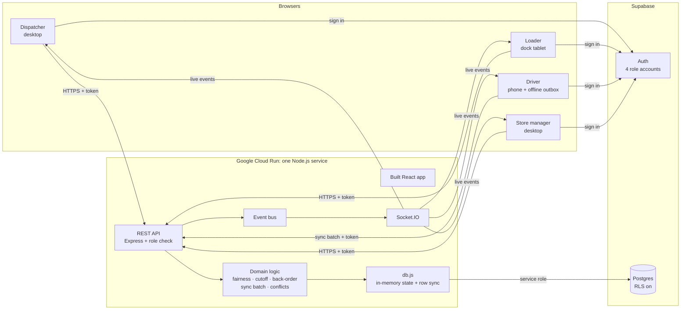

# Waypoint

[](https://github.com/theenuka/smoothOperator_Waypoint/actions/workflows/ci.yml) [](https://github.com/theenuka/smoothOperator_Waypoint/actions/workflows/deploy.yml)

**Explain the decision. Execute the run. Never lose the truth in between.**

Waypoint is a delivery operations platform for a retail chain that supplies its outlets from regional depots. It connects the four people who touch every delivery (the dispatcher, the dock loader, the driver and the store manager) to one live source of truth.

Team **smoothOperator** · Rootcode Tech-Triathlon 2026

**Live demo:** [waypoint.theenuka.in](https://waypoint.theenuka.in) (backup: [waypoint-618048768001.asia-southeast1.run.app](https://waypoint-618048768001.asia-southeast1.run.app)). Accounts are in [Seeded accounts](#seeded-accounts).


## The problem

Three things go wrong every day in outlet replenishment:

1. **Chilled capacity is short.** There are more chilled orders than refrigerated truck slots, so some stores wait. Today that decision is made ad hoc and the store finds out when the truck doesn't come.
2. **The dock is short.** Stock runs out while a truck is being loaded. Either the truck leaves late, or it leaves short and the store is surprised at the door.
3. **Drivers lose signal.** On routes like the A1 to Kandy, proof of delivery is lost or silently overwritten by changes made in the office.

## What Waypoint does

| Role | Device | In Waypoint |
|---|---|---|
| Dispatcher | Desktop | Plans tomorrow's runs. When chilled slots run out, a fairness rule suggests who waits and the dispatcher sends each store the reason. |
| Loader | Shared dock tablet | Checks every line onto the truck. A shortfall is flagged in seconds without blocking the truck, and the missing quantity is back-ordered automatically. |
| Driver | Own phone (installable web app) | Delivers with signature and photo proof. Everything works with no signal and syncs itself later. Real disagreements with the office are shown side by side for the driver to decide. |
| Store manager | Desktop | Orders before the 16:00 cutoff, sees what is coming and why anything changed, confirms what arrived and reports problems. |

Every change is published as an event and pushed to every open screen, so a shortfall flagged at the dock appears on the dispatcher's feed, the driver's route and the store's notices at the same moment.

### Degradation scenarios

- **Dock shortfall:** the loader flags 6 of 10 cartons. The truck still leaves on time; dispatch, the driver and the store are told immediately, and the other 4 are added to the store's next order.
- **No signal:** deliveries are stored in an outbox on the phone and synced oldest first when signal returns. Duplicates are ignored, one bad record never blocks the rest, and a delivery that conflicts with an office change is never overwritten silently: the driver chooses, and the decision is logged.

### Fair chilled allocation

When chilled orders exceed reefer slots, outlets that waited on either of the last two runs, or twice in 14 days, are protected. The rest are ranked by the longest gap since their last chilled delivery, and on a tie the smaller order waits. The dispatcher makes the final call and the store reads the reason in plain language.

## Screens

### Dispatcher: plan and allocate
Capacity, the reefer fleet and the fairness ranking update as the dispatcher ticks who waits.


### Loader: the dock tablet
Dark, glove-friendly screens for 04:30. The truck is loaded last stop first, and a shortfall is flagged without blocking it.


### Driver: the phone
Route, stop handover, proof of delivery with signature and photo, and the sync decision when phone and office disagree.


### Store manager
What is coming and why it changed, in plain language.


## Architecture



- **Domain logic is pure and tested.** Every rule (fairness, cutoff, back-orders, stop results, sync batching, conflict detection, order validation) lives in `server/src/logic/` with no I/O and is covered by unit tests.
- **One contract.** All endpoints and live events are documented in [docs/API_CONTRACT.md](docs/API_CONTRACT.md).
- **Sign-in and data on Supabase.** Each role signs in with its own account; the server checks the token and the role on every call. Data lives in Supabase Postgres and only the server can reach it.

More detail: [docs/ARCHITECTURE.md](docs/ARCHITECTURE.md) and [docs/DATA_MODEL.md](docs/DATA_MODEL.md).

## Tech stack

Node.js 20, Express, Socket.IO, React 18, Vite, React Router, Leaflet with OpenStreetMap, Supabase (Postgres and Auth), Node's built-in test runner, Prettier, Docker Compose, GitHub Actions, Google Cloud Run.

## Run it (judges start here)

### Seeded accounts

One account per role. The sign-in page fills in the email for the role you pick.

| Role | Email | Live site password | Local (Docker) password |
|---|---|---|---|
| Dispatcher | kavindi@waypoint.demo | `Waypoint-nD8yI_TT` | `Waypoint-local-demo` |
| Loader | ruwan@waypoint.demo | `Waypoint-nD8yI_TT` | `Waypoint-local-demo` |
| Driver | chamara@waypoint.demo | `Waypoint-nD8yI_TT` | `Waypoint-local-demo` |
| Store manager (OUT014 Dehiwala) | nadeeka@waypoint.demo | `Waypoint-nD8yI_TT` | `Waypoint-local-demo` |

### Run the full stack locally

You only need Docker. One command starts the app and a local Supabase (Postgres, auth, REST API and a gateway), creates the tables, loads the demo data and creates the four accounts. Nothing is called in the cloud.

```bash
git clone https://github.com/theenuka/smoothOperator_Waypoint.git
cd smoothOperator_Waypoint
docker compose up
```

Open http://localhost:8080 when the log says `Waypoint API on http://localhost:8080`. The first start downloads about 1 GB of images and takes a few minutes. Ports 8080 and 8000 must be free.

Configuration: `docker-compose.yml` has local-only defaults for every value, listed in [`.env.example`](.env.example). To change one, `cp .env.example .env` and edit it. Stop with `Ctrl+C`; the data is kept between starts, and `docker compose down -v` deletes it so the next start begins from the seeded scenario.

### Judge walkthrough (about 3 minutes)

The scenario always runs on today's date (Sri Lanka time; on a new day the data starts again from the seed): the Kandy truck (VEH022) is on the road and tomorrow is being planned.

1. On the home page, open all four roles. Each opens in its own tab; sign in with the account above. All four stay signed in side by side.
2. **Loader** (Ruwan): VEH037 is waiting at bay 02 for the Colombo city run. **Start loading**: it is loaded last stop first, so Kirulapone comes first. Check each line; on **Rice, 5 kg bag** count 3 of 4, pick a reason and **Flag 1 short and keep loading**, then load the rest and **Finish loading**. The truck is not blocked.
3. **Dispatcher** (Kavindi): the shortfall and the sealed truck are already in the live feed, no refresh. The missing bag is on Kirulapone's next order. The Kandy truck (VEH022) is already on the road with an earlier shortfall at Kegalle, which the **Driver** (Chamara) sees on his route.
4. **Dispatcher:** open **Plan**: 8 chilled orders for 5 reefer slots. Open **Decide**, keep the three suggested waits, write the reason and **Confirm 3 deferrals**.
5. **Store manager** (Nadeeka, OUT014 Dehiwala): Today shows she is protected on the next tight day. **Check what arrived** on this morning's delivery and confirm it, then place an order in **Order**: it appears in the dispatcher's feed at once.
6. **Driver:** tap **Online** at the top to go to **No signal**, deliver Kegalle with a signature (saved on the phone), then go back online and watch it sync.
7. **Dispatcher:** **Reset to seed data** in the top bar puts the scenario back.

The full five minute script is in [docs/DEMO_SCRIPT.md](docs/DEMO_SCRIPT.md).

## Changes from the Designathon submission

The screens follow the Day 5 Designathon submission: the same four roles, personas, depots and outlets, and the same screen set (DP1-DP6, LD1-LD6, DR1-DR7, SM1-SM7). The design covered the experience only. Significant changes and additions in the build:

- **Sign-in per role.** The design had no sign-in. Each role now has its own account, and one browser can be signed in as all four roles at once for the demo. The loader signs in with email and password instead of the PIN on the shared dock tablet in the design.
- **Live map.** Dispatcher live tracking (DP5) uses an interactive OpenStreetMap map with a fleet selector instead of the drawn route map in the design.
- **Data and architecture.** Not part of the design. The build is one Node.js service with the domain rules in `server/src/logic/`, data in Supabase Postgres, and Socket.IO pushing every change to the other roles live. See [docs/ARCHITECTURE.md](docs/ARCHITECTURE.md).
- **Deployment.** Docker Compose for local runs, Google Cloud Run for the live site, and GitHub Actions that test every change and deploy `main` after the tests pass. See [docs/DEPLOY.md](docs/DEPLOY.md).

## Development

Requires Node.js 20 or newer and Docker.

```bash
npm install
docker compose up db auth rest gateway seed-users   # local Supabase only
cp server/.env.example server/.env && cp web/.env.example web/.env   # fill with the local values, see docs/AUTH.md
npm run dev          # API on :4000, web app on http://localhost:5173
```

Never point a local server at the live Supabase project: it would change the live demo data.

| Command | |
|---|---|
| `npm run dev` | API and web app with reload |
| `npm test` | Domain logic unit tests |
| `npm run build` | Production build of the web app |
| `npm start` | API also serves the built app on one port |
| `npm run format` | Format the code base |
| `npm run sim` | Drive VEH022 along the A1 so the live map moves |

## Project structure

```
server/src/
  index.js            API server, routes and live events
  db.js, seed.json    data access (Supabase) and demo scenario
  auth.js             token and role check
  events.js           event bus (audit log + Socket.IO broadcast)
  logic/              pure domain rules (unit tested in server/test/)
  routes/             orders, planning, deferrals, notices, issues,
                      runs, loads, deliveries, sync, tracking
web/src/
  shared/             design tokens, UI components, API client, live hooks
  roles/dispatcher/   DP1-DP6
  roles/loader/       LD1-LD6
  roles/driver/       DR1-DR7 and the offline outbox
  roles/store/        SM1-SM7
docs/                 architecture, data model, API contract, AI disclosure,
                      design system, deployment, demo
docker-compose.yml    full local stack (app + local Supabase)
```

## Documentation

- [Architecture](docs/ARCHITECTURE.md)
- [Data model](docs/DATA_MODEL.md)
- [API contract](docs/API_CONTRACT.md)
- [Sign-in and database](docs/AUTH.md)
- [AI tool disclosure](docs/AI_DISCLOSURE.md)
- [Design system](docs/DESIGN_GUIDE.md) and the reference designs in [docs/design](docs/design)
- [Deployment](docs/DEPLOY.md)
- [Demo walkthrough](docs/DEMO_SCRIPT.md)
- [Contributing](CONTRIBUTING.md)

## Team smoothOperator

| | |
|---|---|
| Theenuka Bandara | Platform, integration, delivery and sync services |
| Shukri Ahamed | Orders, planning, deferral and store notice services |
| Vanuja Karunaratne | Dispatcher app |
| Chinthaka Dissanayake | Dock loader app |
| Hirushan Wijesiriwardena | Driver app and offline sync |
| Thivanka Dissanayaka | Store manager app |
