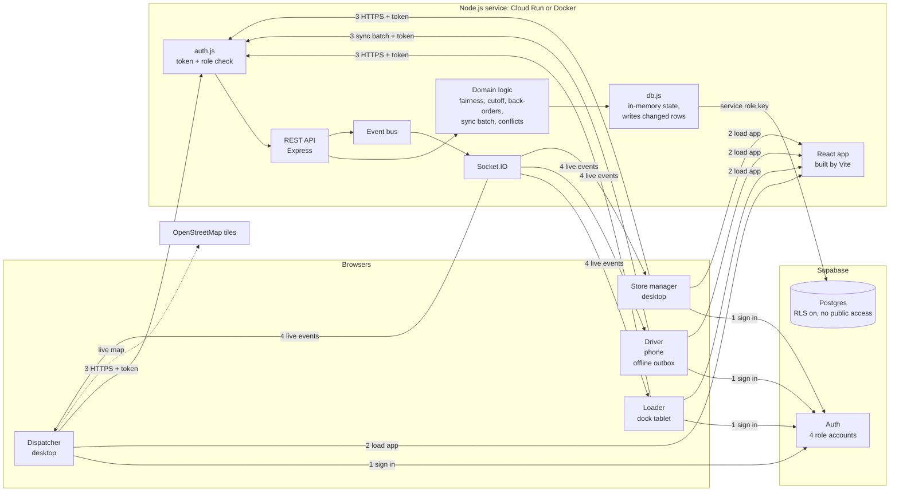
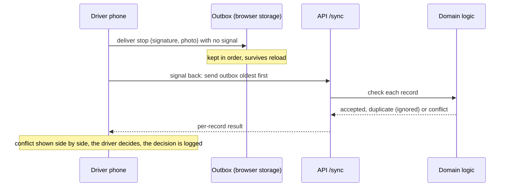

# Architecture

Waypoint is one Node.js service that serves the web app, the REST API and live events, backed by Supabase for sign-in and data. The same setup runs on Google Cloud Run (live site) and in Docker Compose (local, with a local Supabase).

## Main components

1. **Sign in.** Each role signs in to Supabase Auth with its own account. The browser keeps one session per role, so all four roles can be open side by side.
2. **Load the app.** The service serves the built React app; each role has its own screens under `/dispatcher`, `/loader`, `/driver` and `/store`.
3. **API calls.** Every `/api` call carries the access token. `auth.js` checks it and the role against the `ACCESS` table (wrong role gets `403`). Routes call pure domain rules in `server/src/logic/` and read and change data through `db.js`.
4. **Live events.** Every change is published on the event bus, written to the audit log and pushed over Socket.IO to every signed-in screen, so a shortfall flagged at the dock reaches dispatch, the driver and the store at once.

## How data is stored and connected

- **Supabase Postgres** holds one table per list (`orders`, `runs`, `deferrals`, `deliveries`, ...) and an `app_state` table for single objects. Details and the diagram: [DATA_MODEL.md](DATA_MODEL.md).
- **Only the server** reaches the database, with the service role key. Row Level Security is on with no policies, so the public key in the browser can read nothing.
- **In memory, one instance.** `db.js` loads the tables on start and writes back only the rows that changed. The service runs as a single Cloud Run instance with session affinity, which also keeps Socket.IO simple.
- **Records link by id:** an order belongs to an outlet (`outletId`), a run lists its stops by `orderId`, deferrals, deliveries, conflicts and notices point at the order or outlet they are about.

## Driver offline sync

One bad record never blocks the rest, and an office change is never overwritten silently.

## Deployment

- **Live:** Google Cloud Run (asia-southeast1) at https://waypoint.theenuka.in. The service role key is in Secret Manager.
- **CI/CD:** GitHub Actions runs format check, tests and build on every pull request. After CI passes on `main`, the Deploy workflow builds and deploys to Cloud Run using Workload Identity Federation (no stored keys) and smoke tests `/api/health`. See [DEPLOY.md](DEPLOY.md).
- **Local:** `docker compose up` runs the service with a local Supabase (Postgres, Auth, PostgREST and an nginx gateway), seeded with the demo data and accounts.
