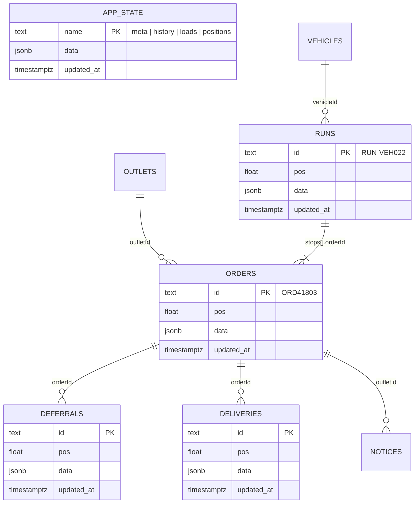

# Data model

## How it is stored

The data lives in **Supabase Postgres** (`server/supabase/schema.sql`). Each list is its own table with the same three columns, and the single objects live in one key-value table:

- **List tables:** `depots`, `outlets`, `vehicles`, `orders`, `deferrals`, `runs`, `deliveries`, `conflicts`, `notices`, `issues`, `events`. Columns: `id` (primary key), `pos` (list order), `data` (the record as JSONB), `updated_at`.
- **`app_state`:** one row each for `meta`, `history`, `loads` and `positions`.
- **Access:** Row Level Security is on with no policies, so the public anon key in the browser can read or write nothing. Only the server, with the service role key, reaches the tables.
- **In the server:** `server/src/db.js` loads every table into memory on start (one instance), routes read and change it through `db()`, and `save()` writes back only the rows that changed. On the first start, empty tables are filled from `server/src/seed.json`; **Reset to seed data** puts the seed back.
- **Accounts:** the four demo users live in Supabase Auth. Their role, name and outlet are in `app_metadata`, which only an admin can change, and the server checks the role on every call (`server/src/auth.js`).

## Records

The shape of each record (the `data` column). New optional fields can be added freely; existing fields are not renamed or removed, because several screens read them.

| Key | Type | Example | Notes |
|---|---|---|---|
| `meta` | object (app_state) | `{ demoDate: "2026-09-29", planDate: "2026-09-30", cutoff: "16:00" }` | The demo's "today" and "tomorrow" |
| `depots` | array | `{ id: "PLG", name: "Peliyagoda depot" }` | PLG and KDY |
| `outlets` | array | `{ id: "OUT083", name: "Kegalle", depot, lat, lng, dockOpen: "07:00", dockClose: "13:00", manager: "Sunil Perera" }` | 13 outlets |
| `vehicles` | array | `{ id: "VEH014", type: "reefer"\|"dry", capacityKg, slots, driver, depot, status: "on_road"\|"at_depot"\|"workshop" }` | Reefer `slots` = chilled orders it can carry. VEH031 is in the workshop |
| `orders` | array | `{ id: "ORD41803", outletId, deliveryDate, chilled, lines:[{ sku, name, qty, unit }], kg, status, placedAt, changedAt?, changedBy? }` | `status`: placed → planned → loaded → delivered, or deferred / failed |
| `history.lastChilledDelivery` | object | `{ "OUT031": "2026-09-26T06:40:00+05:30" }` | Used by the fairness rule |
| `deferrals` | array | `{ id, orderId, outletId, fromDate, toDate, reason, decidedBy, at, reversed, reversedAt?, reversedBy?, note? }` | Never deleted, only reversed (audit trail) |
| `runs` | array | `{ id: "RUN-VEH022", vehicleId, date, driver, bay, status, departedAt, stops:[{ seq, outletId, orderId, eta, status }] }` | A run is one truck's route for one day |
| `loads` | object (app_state) | `{ "RUN-VEH022": { runId, status, lines:[{ orderId, stopSeq, sku, name, planned, loaded, checked }], shortfalls:[...] } }` | Keyed by run id |
| `deliveries` | array | delivery records (see API contract) + `id`, `syncedAt` | Proof of delivery |
| `conflicts` | array | see API contract | Open ones show on DR6 |
| `notices` | array | `{ id, outletId, type: "deferral"\|"shortfall", title, body, at, read }` | What the store manager reads, newest first |
| `positions` | object (app_state) | `{ "VEH022": { vehicleId, lat, lng, at, online, place } }` | Last known position per vehicle |
| `events` | array | `{ id, type, at, payload }` | Audit log, newest first, last 500 |

## The demo story in the data

The seed is written for Tuesday 29 September. When it seeds the tables (first start, **Reset to seed data**, or the first request on a new day), the server moves the whole scenario to today's date in Sri Lanka (`server/src/logic/seedDates.js`), so every gap, cutoff and "waited twice in 14 days" stays true. The dates below are the seed's.

- **Today (Tue 29 Sep):** Chamara drives VEH022 from Peliyagoda to Kandy: Kadawatha ✔, Nittambuwa ✔, **Kegalle (next)**, Peradeniya, Kandy City.
- **Shortfall:** at 05:38 Ruwan loaded only 6 of 10 detergent for Kegalle (`loads.RUN-VEH022.shortfalls[0]`). Kegalle already has a notice.
- **Tomorrow (Wed 30 Sep):** 8 chilled orders, 5 reefer slots (VEH031 in the workshop). Negombo and Nugegoda waited on Tuesday, Dehiwala waited twice in 14 days, so all three are protected. Borella, Wattala and Kirulapone are suggested to wait.
- **Conflict demo:** while the driver is offline, dispatch moves Kandy City (ORD41805) to tomorrow, but the driver delivers it. When the phone syncs, DR6 asks the driver to decide.
